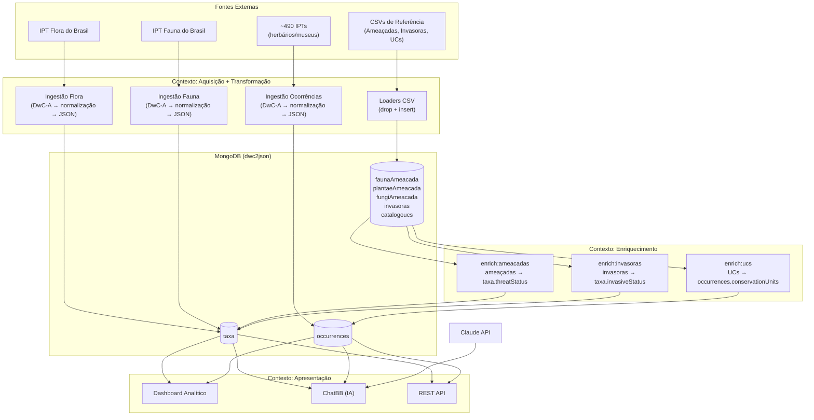

# Biodiversidade.Online V6.1 - Uma Base de Dados Integrada da Biodiversidade Brasileira

[Eduardo Dalcin](https://github.com/edalcin) e [Henrique Pinheiro](https://github.com/Phenome)

[](https://doi.org/10.5281/zenodo.18668804)
[](https://github.com/biopinda/Biodiversidade-Online/actions/workflows/update-mongodb-flora.yml)
[](https://github.com/biopinda/Biodiversidade-Online/actions/workflows/update-mongodb-fauna.yml)
[](https://github.com/biopinda/Biodiversidade-Online/actions/workflows/update-mongodb-occurrences.yml)
[](https://github.com/biopinda/Biodiversidade-Online/pkgs/container/biodiversidade-online)

## Objetivo

Construir uma **base de dados unificada da biodiversidade brasileira**, integrando dados taxonômicos (flora, fauna), registros de ocorrência e dados de enriquecimento (espécies ameaçadas, invasoras, unidades de conservação), com acesso via **Dashboard analítico**, **assistente conversacional (ChatBB)** e **REST API**.

## Arquitetura C4

O projeto é organizado em três contextos principais. Todas as coleções residem em um **único banco de dados MongoDB** (`dwc2json`):



## Fontes de Dados

**Dados Taxonômicos:**

- [Flora e Funga do Brasil](http://floradobrasil.jbrj.gov.br/) - Catálogo oficial de espécies vegetais e fúngicas
- [Catálogo Taxonômico da Fauna do Brasil](http://fauna.jbrj.gov.br/) - Base oficial de espécies animais

**Dados de Ocorrências:**

- ~490 repositórios IPT com milhões de registros de ocorrência
- Validação geográfica (coordenadas, estados via códigos IBGE)

**Dados de Enriquecimento (CSVs carregados manualmente):**

- `faunaAmeacada` — Status de ameaça de extinção da fauna (MMA/ICMBio)
- `plantaeAmeacada` — Status de ameaça da flora (CNCFlora/Plantae)
- `fungiAmeacada` — Status de ameaça de fungos (CNCFlora/Fungi)
- `invasoras` — Espécies invasoras e impactos ecossistêmicos
- `catalogoucs` — Catálogo de Unidades de Conservação (CNUC/ICMBio)

## Pipeline de Dados

Todos os workflows são **manuais** (acionados via GitHub Actions):

**Aquisição + Transformação:**

- **Ingestão Flora** — DwC-A → normalização → `taxa`
- **Ingestão Fauna** — DwC-A → normalização → `taxa`
- **Ingestão Ocorrências** — DwC-A → normalização → `occurrences`

**Enriquecimento Temático:**

O enriquecimento é organizado por **temas**, cada um representando uma fonte externa de dados que agrega informação às coleções principais. A arquitetura é extensível — novos temas seguem o mesmo padrão (loader CSV → coleção de referência → enricher in-place).

Temas atuais:

- **Ameaçadas** — Associa dados de espécies ameaçadas a `taxa` (`threatStatus`)
- **Invasoras** — Associa dados de espécies invasoras a `taxa` (`invasiveStatus`)
- **UCs** — Associa dados de unidades de conservação a `occurrences` (`conservationUnits`)

Temas futuros possíveis: dados de DNA/barcoding, princípios ativos, uso por comunidades tradicionais.

## Tecnologias

- **Runtime**: Bun
- **Linguagem**: TypeScript
- **Framework Web**: Astro.js com Astro Islands
- **Estilização**: Tailwind CSS
- **Banco de Dados**: MongoDB
- **IA/LLM**: Claude API (Anthropic) via Model Context Protocol (MCP)
- **Documentação API**: Swagger/OpenAPI
- **Automação**: GitHub Actions (workflows manuais)
- **Containerização**: Docker

## Como Usar

### Pré-requisitos

- Bun instalado
- MongoDB acessível via `MONGO_URI`
- Node.js v20.19.4+
- Docker (opcional)
- Chave da Claude API para ChatBB (variável `CLAUDE_API_KEY`)

### Execução Local

```bash
# Instalar dependências dos workspaces
bun install

# === Aquisição + Transformação ===
bun run ingest:flora <dwc-a-url>
bun run ingest:fauna <dwc-a-url>
bun run ingest:occurrences

# === Carga de dados de referência (CSV → MongoDB) ===
bun run load:fauna-ameacada -- <caminho/fauna-ameacada.csv>
bun run load:plantae-ameacada -- <caminho/plantae-ameacada.csv>
bun run load:fungi-ameacada -- <caminho/fungi-ameacada.csv>
bun run load:invasoras -- <caminho/invasoras.csv>
bun run load:catalogo-ucs -- <caminho/cnuc.csv>

# === Enriquecimento in-place ===
bun run enrich:ameacadas      # Adiciona threatStatus em taxa
bun run enrich:invasoras      # Adiciona invasiveStatus em taxa
bun run enrich:ucs            # Adiciona conservationUnits em occurrences

# === Aplicação Web (Apresentação) ===
cd packages/web
bun run dev              # Desenvolvimento (http://localhost:4321)
bun run build            # Build para produção
node dist/server/entry.mjs  # Servidor de produção
```

### Via Docker

```bash
docker pull ghcr.io/biopinda/darwincorejson:latest
docker run -p 4321:4321 \
  -e MONGO_URI="mongodb://..." \
  -e CLAUDE_API_KEY="sk-..." \
  ghcr.io/biopinda/darwincorejson:latest
```

### Interfaces

- **Dashboard Analítico**: http://localhost:4321/
- **ChatBB**: http://localhost:4321/chat
- **Swagger API**: http://localhost:4321/api/docs
- **API Taxa**: http://localhost:4321/api/taxa
- **API Ocorrências**: http://localhost:4321/api/occurrences

## Estrutura do Projeto

```
├── packages/
│   ├── ingest/          # Aquisição + Transformação: DwC-A → normalização → MongoDB
│   ├── transform/       # Enriquecimento: loaders CSV + enrichers in-place
│   ├── shared/          # Utilitários compartilhados (database, IDs, métricas)
│   └── web/             # Apresentação: Dashboard, ChatBB, REST API
├── .github/workflows/   # Workflows manuais (GitHub Actions)
├── docs/                # Documentação
├── patches/             # Patches de dependências
└── scripts/             # Scripts utilitários
```

## Histórico de Versões

- **V6.1** (atual - 2026): Pipeline de enriquecimento in-place (CSV → loaders → enrich), renomeação de coleções de referência, arquitetura C4 consolidada
- **V6.0** (2026): Reestruturação com arquitetura C4 (Aquisição, Transformação, Apresentação), remoção de componentes legados, foco em API e MCP
- **V5.0** (2025): Integração com ChatBB e protocolo MCP, pipeline integrado ingestão+transformação
- **V4.0** (2024): Integração de dados de ocorrência de ~490 IPTs
- **V2.0** (2024): Agregação do Catálogo Taxonômico da Fauna do Brasil
- **V1.0** (2023): Conversão de dados DwC-A para JSON (Flora e Funga do Brasil)

## Projetos Relacionados

O projeto [coletoresDWC2JSON](https://github.com/edalcin/coletoresDWC2JSON) complementa o Biodiversidade.Online fornecendo ferramentas de canonicalização de nomes de coletores, normalizando variações e aumentando a consistência dos dados.

## Contribuições

Dúvidas, sugestões e contribuições são bem-vindas através das [issues do projeto](https://github.com/biopinda/Biodiversidade-Online/issues).

## Citação

```bibtex
@software{pinheiro_dalcin_2026,
  title = {Biodiversidade.Online: Uma Base de Dados Integrada da Biodiversidade Brasileira},
  author = {Pinheiro, Henrique and Dalcin, Eduardo},
  year = {2026},
  version = {6.1},
  doi = {10.5281/zenodo.18668804},
  url = {https://github.com/biopinda/Biodiversidade-Online}
}
```

## Licença

Este projeto é desenvolvido como software livre para a comunidade científica brasileira.
