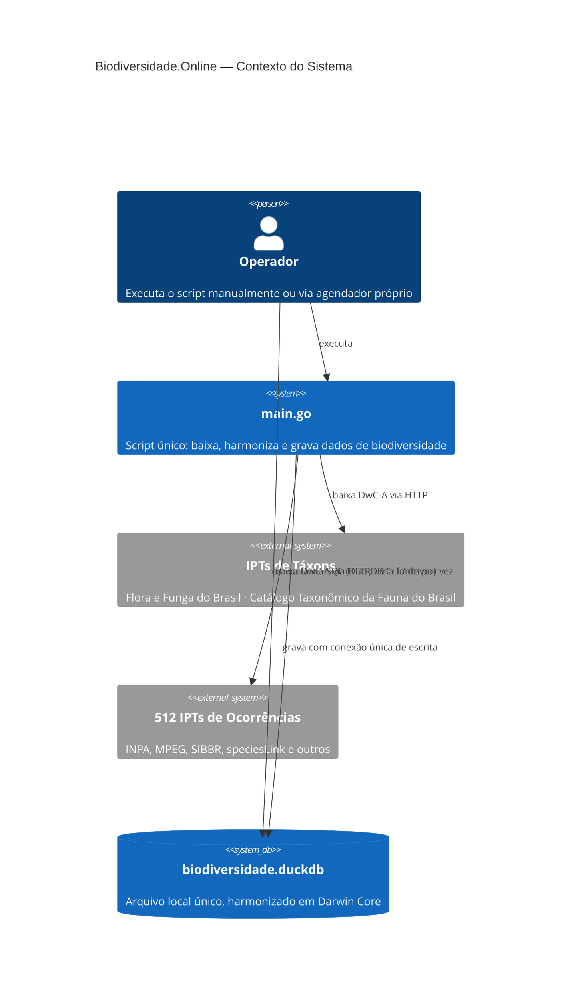
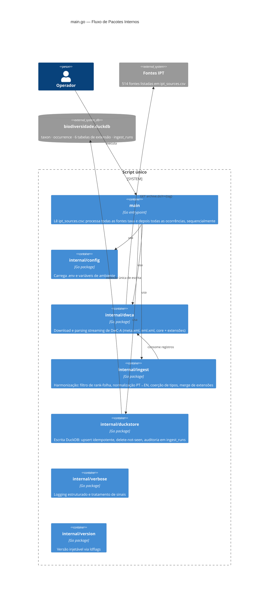

# Biodiversidade.Online — Base DuckDB de Espécies e Ocorrências

[Eduardo Dalcin](https://github.com/edalcin) · [Henrique Pinheiro](https://github.com/Phenome)

[](https://doi.org/10.5281/zenodo.18668804)
[](LICENSE)

---

## Visão Geral

**Biodiversidade.Online** é uma ferramenta de linha de comando, de propósito único: um script Go que baixa Darwin Core Archives (DwC-A) publicados por fontes IPT — fauna, flora e 512 coleções de ocorrências — e grava um único arquivo [DuckDB](https://duckdb.org/) local, com dados harmonizados e nomeados segundo o padrão Darwin Core.

Não há mais suite multi-contexto, banco compartilhado ou serviço hospedado: é um binário que você executa manualmente (ou agenda como preferir) e que produz um arquivo `.duckdb` pronto para consulta via SQL.

---

## Diagrama C4 — Contexto do Sistema


```mermaid
C4Context
    title Biodiversidade.Online — Contexto do Sistema

    Person(operador, "Operador", "Executa o script manualmente ou via agendador próprio")

    System(script, "main.go", "Script único: baixa, harmoniza e grava dados de biodiversidade")

    System_Ext(ipt_taxa, "IPTs de Táxons", "Flora e Funga do Brasil · Catálogo Taxonômico da Fauna do Brasil")
    System_Ext(ipt_occ, "512 IPTs de Ocorrências", "INPA, MPEG, SIBBR, speciesLink e outros")
    SystemDb(duckdb, "biodiversidade.duckdb", "Arquivo local único, harmonizado em Darwin Core")

    Rel(operador, script, "executa")
    Rel(script, ipt_taxa, "baixa DwC-A via HTTP")
    Rel(script, ipt_occ, "baixa DwC-A via HTTP, uma fonte por vez")
    Rel(script, duckdb, "grava com conexão única de escrita")
    Rel(operador, duckdb, "consulta via SQL (DuckDB CLI / driver)")
```

## Diagrama C4 — Pacotes Internos


```mermaid
C4Container
    title main.go — Fluxo de Pacotes Internos

    Person(operador, "Operador")

    System_Ext(ipt, "Fontes IPT", "514 fontes listadas em ipt_sources.csv")
    SystemDb_Ext(duckdb, "biodiversidade.duckdb", "taxon · occurrence · 6 tabelas de extensão · ingest_runs")

    System_Boundary(app, "Script único") {
        Container(main_bin, "main", "Go entrypoint", "Lê ipt_sources.csv; processa todas as fontes taxa e depois todas as ocorrências, sequencialmente")
        Container(config_pkg, "internal/config", "Go package", "Carrega .env e variáveis de ambiente")
        Container(dwca_pkg, "internal/dwca", "Go package", "Download e parsing streaming de DwC-A (meta.xml, eml.xml, core + extensões)")
        Container(ingest_pkg, "internal/ingest", "Go package", "Harmonização: filtro de rank-folha, normalização PT→EN, coerção de tipos, merge de extensões")
        Container(duckstore_pkg, "internal/duckstore", "Go package", "Escrita DuckDB: upsert idempotente, delete-not-seen, auditoria em ingest_runs")
        Container(verbose_pkg, "internal/verbose", "Go package", "Logging estruturado e tratamento de sinais")
        Container(version_pkg, "internal/version", "Go package", "Versão injetável via ldflags")
    }

    Rel(operador, main_bin, "executa")
    Rel(main_bin, config_pkg, "usa")
    Rel(main_bin, dwca_pkg, "usa")
    Rel(main_bin, ingest_pkg, "usa")
    Rel(main_bin, duckstore_pkg, "usa")
    Rel(dwca_pkg, ipt, "GET archive.do?r={tag}")
    Rel(ingest_pkg, dwca_pkg, "consome registros")
    Rel(duckstore_pkg, duckdb, "conexão única de escrita")
```

---

## O que faz

Uma única execução de `main.go`:

1. Lê `ipt_sources.csv` (registro único de todas as fontes IPT).
2. Processa, em sequência, todas as fontes do tipo `taxa` e depois todas do tipo `ocorrencias` — nessa ordem, numa única conexão de escrita DuckDB (ver [ADR 0002](docs/adr/0002-script-unico-sequencial.md)).
3. Para cada fonte: baixa o DwC-A mais recente, lê `meta.xml`/`eml.xml`, e pula a fonte se a versão do pacote não mudou desde a última execução bem-sucedida.
4. Harmoniza cada registro para o vocabulário Darwin Core: mantém apenas táxons-folha (espécie/sub-espécie/variedade/forma), normaliza valores PT→EN, corrige tipos (datas, floats, ints), sinaliza (sem descartar) coordenadas suspeitas, e deduplica/mescla as extensões de táxon antes de gravar.
5. Grava com upsert idempotente nas tabelas `taxon`/`occurrence` e nas tabelas de extensão, removendo (delete-not-seen) registros da mesma fonte ausentes na execução atual.
6. Registra a execução na tabela de auditoria `ingest_runs` (contadores, avisos, status).

## Pré-requisitos

- **Go 1.25+**
- **Um compilador C no `PATH`** — o driver DuckDB (`github.com/marcboeker/go-duckdb`) exige CGO.
  - Windows: instale uma distribuição MinGW-w64, por exemplo `winget install -e --id BrechtSanders.WinLibs.POSIX.UCRT`.
  - Linux/macOS: o gcc/clang padrão do sistema normalmente já é suficiente.

## Bootstrap rápido

```bash
# 1. Clonar o repositório
git clone https://github.com/biopinda/Biodiversidade-Online.git
cd Biodiversidade-Online

# 2. (Opcional) copiar/editar variáveis de ambiente — todas têm defaults sensatos
export LOG_LEVEL=debug

# 3. Compilar
go build -trimpath -ldflags="-s -w" -o bin/ .

# 4. Executar
./bin/biodiversidade-online
# ou, sem compilar:
go run .
```

Ao final, o arquivo `biodiversidade.duckdb` (por padrão, na raiz do repositório) contém todos os dados harmonizados.

## Configuração (variáveis de ambiente)

Todas opcionais, com defaults documentados:

```dotenv
DB_PATH=./biodiversidade.duckdb     # caminho do arquivo DuckDB gerado
IPT_SOURCES_CSV=./ipt_sources.csv   # registro único de fontes IPT
BULK_BATCH_SIZE=5000                # tamanho de lote para escrita em massa
HTTP_TIMEOUT_MIN=30                 # timeout HTTP por download, em minutos
LOG_LEVEL=info                      # debug | info | warn | error
LOG_FORMAT=text                     # text | json
CACHE_DIR=                          # opcional — deixe vazio para não cachear downloads
```

Não há mais `MONGO_URI`, `MONGO_DATABASE`, `IPT_FAUNA_URL`, `IPT_FLORA_URL` nem `IPT_OCCURRENCES_CSV`: o par fauna/flora e as 512 coleções de ocorrências vivem agora num único registro (`ipt_sources.csv`).

## Fontes IPT (`ipt_sources.csv`)

Registro único na raiz do repositório, colunas `tipo,nome,repositorio,kingdom,tag,url`, onde `tipo` é `taxa` ou `ocorrencias`. Contagem atual (verificada em 2026-09-14): **514 fontes** — 2 do tipo `taxa` (Flora e Funga do Brasil, Catálogo Taxonômico da Fauna do Brasil) e 512 do tipo `ocorrencias` (INPA, MPEG, SIBBR, speciesLink e outras instituições).

## Banco de Dados (`biodiversidade.duckdb`)

Arquivo DuckDB local, gerado pela execução do script e **não versionado** (veja `.gitignore`). Esquema fixo em Darwin Core, não passthrough (ver [ADR 0003](docs/adr/0003-esquema-fixo-darwin-core.md)):

| Tabela | Conteúdo | Chave |
|---|---|---|
| `taxon` | Táxons-folha (fauna + flora) com colunas DwC fixas, `canonicalName`/`flatScientificName` computados, e colunas de proveniência (`datasetID`, `datasetName`, `ingestRunId`, `ingestedAt`) | `taxonID` |
| `occurrence` | Registros de ocorrência das 512 fontes | `occurrenceID` |
| `taxon_vernacular_name`, `taxon_distribution`, `taxon_species_profile`, `taxon_reference`, `taxon_types_and_specimen`, `taxon_resource_relationship` | Extensões DwC-A do táxon, normalizadas em tabelas próprias (ver [ADR 0004](docs/adr/0004-tabelas-normalizadas-para-extensoes.md)) | FK `taxonID` |
| `ingest_runs` | Auditoria de cada execução por fonte: contadores, status, avisos, bookkeeping de versão para pular execuções repetidas | — |

Por que DuckDB em vez de SQLite: [ADR 0001](docs/adr/0001-duckdb-sobre-sqlite.md). Glossário de domínio completo em [`CONTEXT.md`](CONTEXT.md).

## Documentação

| Arquivo | Descrição |
|---|---|
| [`openwiki/quickstart.md`](openwiki/quickstart.md) | Ponto de entrada da wiki interna do repositório |
| [`openwiki/architecture/pipeline.md`](openwiki/architecture/pipeline.md) | Modelo de execução do script único e seus pacotes internos |
| [`openwiki/domain/data-flow.md`](openwiki/domain/data-flow.md) | Domínios de negócio, inventário de fontes e regras de harmonização |
| [`openwiki/data-model/duckdb.md`](openwiki/data-model/duckdb.md) | Esquema DuckDB, semântica de upsert e auditoria |
| [`openwiki/operations/cli.md`](openwiki/operations/cli.md) | Execução, variáveis de ambiente e build |
| [`openwiki/testing.md`](openwiki/testing.md) | Cobertura de testes e verificação |
| [`docs/adr/`](docs/adr) | Decisões de arquitetura registradas (DuckDB, script único, esquema fixo, tabelas de extensão) |
| [`CONTEXT.md`](CONTEXT.md) | Glossário de domínio |

## Estrutura do Repositório

```
/
├── main.go                    # Único ponto de entrada
├── ipt_sources.csv            # Registro único de fontes IPT (taxa + ocorrências)
├── biodiversidade.duckdb      # Gerado pela execução — não versionado
├── internal/
│   ├── config/                 # Carregamento e validação de variáveis de ambiente
│   ├── dwca/                   # Download e parsing streaming de DwC-A
│   ├── ingest/                 # Harmonização Darwin Core (filtro, normalização, coerção, merge)
│   ├── duckstore/               # Escrita DuckDB: upsert, delete-not-seen, auditoria
│   ├── verbose/                 # Logger + tratamento de sinais
│   └── version/                 # Versão injetável via ldflags
├── docs/
│   └── adr/                    # Decisões de arquitetura (ADRs)
├── openwiki/                   # Documentação interna navegável
├── CONTEXT.md                  # Glossário de domínio
└── go.mod / go.sum             # Módulo Go
```

## Testes

```bash
go test ./...    # testes unitários (dwca, ingest, duckstore)
go vet ./...     # análise estática
```

---

## Licença

GPL v3 — ver [LICENSE](LICENSE).
