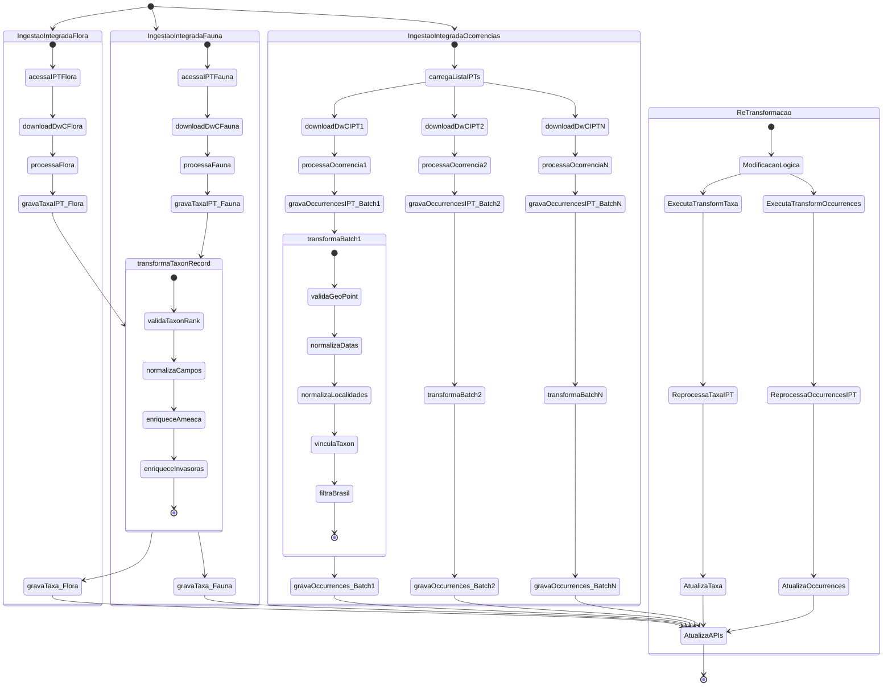

# Workflows de Atualização da Base de Dados

## Arquitetura do Sistema de Atualização

O sistema de atualização opera com **pipeline integrado** onde ingestão e transformação ocorrem no mesmo processo:

### 1. Ingestão Integrada (Raw + Transform)

Dados são baixados, armazenados raw E transformados automaticamente:

- **Flora/Fauna**: `taxa_ipt` (raw) + `taxa` (transformado) no mesmo pipeline
- **Ocorrências**: `occurrences_ipt` (raw) + `occurrences` (transformado) no mesmo pipeline

### 2. Re-transformação (Quando Lógica Muda)

Scripts CLI separados permitem re-processar todos dados quando transformação muda:

- **Taxa**: `bun run transform:taxa` (re-processa `taxa_ipt` → `taxa`)
- **Ocorrências**: `bun run transform:occurrences` (re-processa `occurrences_ipt` → `occurrences`)

## Quando Usar Cada Comando

### Pipeline Integrado (Rotina)

```bash
# Atualização semanal automática (GitHub Actions)
bun run ingest:flora     # Flora: DwC-A → taxa_ipt + taxa
bun run ingest:fauna     # Fauna: DwC-A → taxa_ipt + taxa
bun run ingest:occurrences # Ocorrências: DwC-A → occurrences_ipt + occurrences
```

### Re-transformação (Mudanças na Lógica)

```bash
# Quando modificar arquivos em packages/transform/src/
bun run transform:taxa          # Re-processa todos dados taxonômicos
bun run transform:occurrences   # Re-processa todos dados de ocorrências
```

**Quando usar re-transformação:**

- Modificou validações geográficas ou taxonômicas
- Adicionou novos enriquecimentos (ameaça, invasoras, UCs)
- Corrigiu bugs na normalização de campos
- Atualizou listas de referência (espécies ameaçadas, etc.)

## Workflows GitHub Actions

### Execução Automática Semanal

- **Domingos às 02:00 (UTC)**: Ingestão integrada de Flora (DwC-A → taxa_ipt + taxa)
- **Domingos às 02:30 (UTC)**: Ingestão integrada de Fauna (DwC-A → taxa_ipt + taxa)
- **Domingos às 03:00 (UTC)**: Ingestão integrada de Ocorrências (DwC-A → occurrences_ipt + occurrences)

### Execução Automática por Mudanças

#### Re-transformação Automática

- **`transform-taxa.yml`**: Dispara automaticamente quando modificar:
  - `packages/transform/src/taxa/**` (lógica de transformação de taxa)
  - `packages/transform/package.json` (bump de versão)
  - `packages/shared/src/**` (utilitários compartilhados)

- **`transform-occurrences.yml`**: Dispara automaticamente quando modificar:
  - `packages/transform/src/occurrences/**` (lógica de transformação de ocorrências)
  - `packages/transform/package.json` (bump de versão)
  - `packages/shared/src/**` (utilitários compartilhados)

### Execução Manual (workflow_dispatch)

Todos os workflows podem ser executados manualmente via interface do GitHub Actions:

- `update-mongodb-flora.yml` - Aceita URL customizada para DwC-A
- `update-mongodb-fauna.yml` - Aceita URL customizada para DwC-A
- `update-mongodb-occurrences.yml` - Processa lista de IPTs
- `transform-taxa.yml` - Re-processa todos dados taxonômicos
- `transform-occurrences.yml` - Re-processa todos dados de ocorrências

## Fluxo de Dados Detalhado



## Métricas e Monitoramento

Cada execução registra métricas na coleção `process_metrics`:

- **Duração**: Tempo total de processamento
- **Registros processados**: Contagem de documentos inseridos/atualizados
- **Taxa de sucesso**: Percentual de registros válidos
- **Erros**: Log de falhas para auditoria

## Controle de Concorrência

Sistema de locks na coleção `transform_status` previne execuções simultâneas:

- Lock automático ao iniciar transformação
- Liberação automática ao finalizar com sucesso
- Comando manual para forçar liberação: `bun run transform:check-lock`

## Rastreabilidade de Dados

O campo `_id` é preservado entre coleções raw e transformadas:

- `taxa_ipt._id` = `taxa._id` (baseado em `taxonID`)
- `occurrences_ipt._id` = `occurrences._id` (baseado em `occurrenceID` + `iptId`)

Isso permite auditoria completa: qualquer documento transformado pode ser rastreado até sua origem.

```

```
