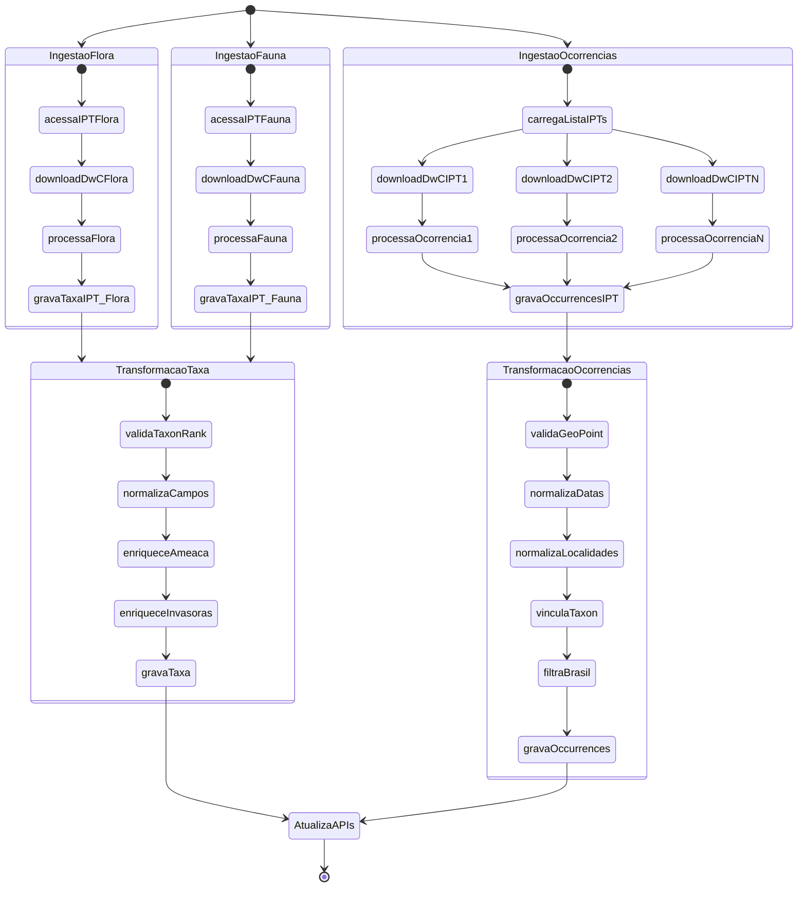

# Workflows de Atualização da Base de Dados

## Arquitetura do Sistema de Atualização

O sistema de atualização da base de dados opera em **duas fases distintas**:

### 1. Fase de Ingestão (Raw Data)

Dados brutos são baixados de fontes DwC-A e armazenados preservando campos originais:

- **Flora/Fauna**: `taxa_ipt` (coleção raw unificada)
- **Ocorrências**: `occurrences_ipt` (coleção raw de ~490 IPTs)

### 2. Fase de Transformação (Processed Data)

Scripts dedicados processam dados brutos aplicando validações, normalizações e enriquecimentos:

- **Taxa**: `taxa_ipt` → `taxa`
- **Ocorrências**: `occurrences_ipt` → `occurrences`

## Workflows GitHub Actions

### Execução Automática Semanal

- **Domingos às 02:00 (UTC)**: Ingestão de Flora
- **Domingos às 02:30 (UTC)**: Ingestão de Fauna
- **Domingos às 03:00 (UTC)**: Ingestão de Ocorrências
- **Após cada ingestão**: Transformação automática dos dados

### Execução Manual (workflow_dispatch)

Todos os workflows podem ser executados manualmente via interface do GitHub Actions.

## Fluxo de Dados Detalhado



## Métricas e Monitoramento

Cada execução registra métricas na coleção `process_metrics`:

- **Duração**: Tempo total de processamento
- **Registros processados**: Contagem de documentos inseridos/atualizados
- **Taxa de sucesso**: Percentual de registros válidos
- **Erros**: Log de falhas para auditoria

## Controle de Concorrência

Sistema de locks na coleção `transform_status` previne execuções simultâneas:

- Lock automático ao iniciar transformação
- Liberação automática ao finalizar com sucesso
- Comando manual para forçar liberação: `bun run transform:check-lock`

## Rastreabilidade de Dados

O campo `_id` é preservado entre coleções raw e transformadas:

- `taxa_ipt._id` = `taxa._id` (baseado em `taxonID`)
- `occurrences_ipt._id` = `occurrences._id` (baseado em `occurrenceID` + `iptId`)

Isso permite auditoria completa: qualquer documento transformado pode ser rastreado até sua origem.

```

```
