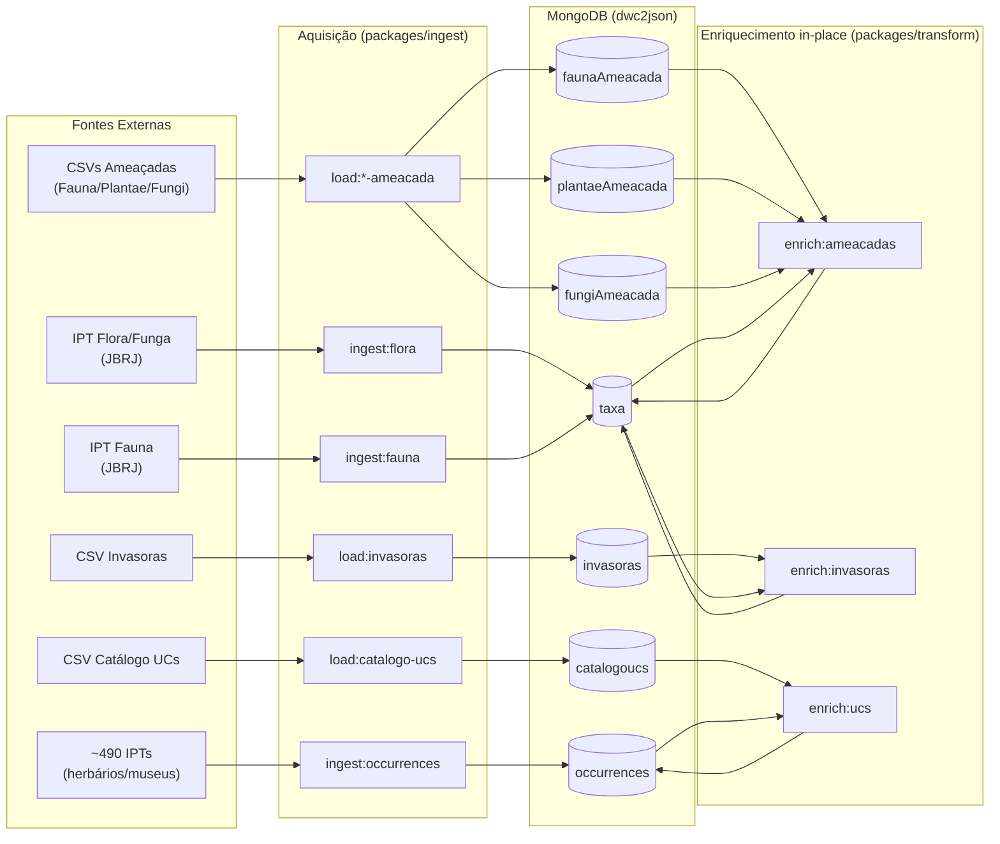

# Workflows de Atualização da Base de Dados

## Arquitetura do Sistema de Atualização

O sistema opera com **duas etapas independentes**: Aquisição (ingestão de dados DwC-A) e Enriquecimento (adição de dados de contexto in-place).

### 1. Aquisição (Ingestão DwC-A)

Dados taxonômicos e de ocorrências são baixados e inseridos diretamente nas coleções principais:

- **Flora/Fauna**: DwC-A → `taxa` (direto, sem intermediário)
- **Ocorrências**: DwC-A → `occurrences` (direto, sem intermediário)

### 2. Enriquecimento (In-place)

Scripts independentes atualizam as coleções principais com dados de contexto sem re-processar toda a coleção:

- **Ameaçadas**: CSVs → `faunaAmeacada`/`plantaeAmeacada`/`fungiAmeacada` → `taxa.$set{threatStatus}`
- **Invasoras**: CSV → `invasoras` → `taxa.$set{invasiveStatus}`
- **UCs**: CSV → `catalogoucs` → `occurrences.$set{conservationUnits}`

## Comandos Disponíveis

### Aquisição (Rotina)

```bash
bun run ingest:flora <url-dwca>    # Flora e Funga do Brasil → taxa
bun run ingest:fauna <url-dwca>    # Catálogo Fauna → taxa
bun run ingest:occurrences         # ~490 IPTs → occurrences
```

### Carga de Dados de Referência (CSV → MongoDB)

```bash
bun run load:fauna-ameacada -- <fauna-ameacada.csv>
bun run load:plantae-ameacada -- <plantae-ameacada.csv>
bun run load:fungi-ameacada -- <fungi-ameacada.csv>
bun run load:invasoras -- <invasoras.csv>
bun run load:catalogo-ucs -- <cnuc.csv>
```

Os loaders fazem **drop + insert** na coleção de destino e recriam os índices.

### Enriquecimento In-place

```bash
bun run enrich:ameacadas   # Atualiza taxa com threatStatus (faunaAmeacada + plantaeAmeacada + fungiAmeacada)
bun run enrich:invasoras   # Atualiza taxa com invasiveStatus (invasoras)
bun run enrich:ucs         # Atualiza occurrences com conservationUnits (catalogoucs)
```

Os enriquecedores iteram sobre a coleção alvo e fazem `$set` nos documentos com match, `$unset` nos que perderam o match.

## Quando Usar Cada Comando

### Atualização de dados taxonômicos (nova versão do IPT)

```bash
bun run ingest:flora <nova-url>
# ou
bun run ingest:fauna <nova-url>
```

Após ingestão, rodar enriquecimento para aplicar threatStatus/invasiveStatus nos novos registros:

```bash
bun run enrich:ameacadas
bun run enrich:invasoras
```

### Atualização das listas de referência (novo CSV)

```bash
# Carregar novo CSV e re-enriquecer
bun run load:fauna-ameacada -- <novo-fauna-ameacada.csv>
bun run enrich:ameacadas
```

### Re-enriquecimento completo (sem novo CSV)

```bash
# Útil após ingestão de novos taxa ou correção de bugs
bun run enrich:ameacadas
bun run enrich:invasoras
bun run enrich:ucs
```

## Workflows GitHub Actions

### Workflows de Aquisição (Manuais)

| Workflow                     | Arquivo                          | Descrição                      |
| ---------------------------- | -------------------------------- | ------------------------------ |
| Update MongoDB - Flora       | `update-mongodb-flora.yml`       | Ingere Flora e Funga do Brasil |
| Update MongoDB - Fauna       | `update-mongodb-fauna.yml`       | Ingere Catálogo da Fauna       |
| Update MongoDB - Ocorrências | `update-mongodb-occurrences.yml` | Ingere ~490 IPTs               |

### Workflows de Enriquecimento (Manuais)

| Workflow                 | Arquivo                | Inputs opcionais                        | Descrição                                            |
| ------------------------ | ---------------------- | --------------------------------------- | ---------------------------------------------------- |
| Enrich Taxa - Ameaçadas  | `enrich-ameacadas.yml` | `csv_fauna`, `csv_plantae`, `csv_fungi` | Carrega CSVs (se fornecidos) e enriquece `taxa`      |
| Enrich Taxa - Invasoras  | `enrich-invasoras.yml` | `csv_invasoras`                         | Carrega CSV (se fornecido) e enriquece `taxa`        |
| Enrich Ocorrências - UCs | `enrich-ucs.yml`       | `csv_ucs`                               | Carrega CSV (se fornecido) e enriquece `occurrences` |

Os workflows de enriquecimento são flexíveis: se um CSV for fornecido como input, ele é carregado antes do enriquecimento; caso contrário, apenas o enriquecimento é executado (com os dados já carregados no banco).

### Outros Workflows

| Workflow     | Arquivo      | Descrição                        |
| ------------ | ------------ | -------------------------------- |
| Docker Build | `docker.yml` | Constrói e publica imagem Docker |

## Fluxo de Dados Detalhado



## Estrutura de Dados Resultante

Após enriquecimento, os documentos de `taxa` contêm:

```javascript
{
  _id: "P12345",
  canonicalName: "Bertholletia excelsa",
  kingdom: "Plantae",
  // ... campos taxonômicos normalizados ...

  // Campos adicionados pelo enriquecimento:
  threatStatus: [
    { source: "plantaeAmeacada", category: "VU" }
  ],
  invasiveStatus: null,  // ou { source: "invasoras", isInvasive: true }
  conservationUnits: [
    { ucName: "Floresta Nacional do Tapajós" }
  ]
}
```

## Operações Manuais no MongoDB

### Renomear coleções legadas (migração única)

Se o banco ainda contém as coleções com nomenclatura antiga, execute:

```javascript
db.cncfloraFungi.renameCollection('fungiAmeacada')
db.cncfloraPlantae.renameCollection('plantaeAmeacada')
```

## Métricas e Monitoramento

Cada execução de enriquecimento reporta no console:

- Registros processados
- Registros enriquecidos (campo adicionado/atualizado)
- Registros limpos (campo removido por perda de match)
- Registros sem alteração

## Controle de Concorrência

Os scripts de enriquecimento **não usam o sistema de locks** (diferente dos pipelines de transformação). São projetados para serem idempotentes — podem ser executados múltiplas vezes com segurança.
