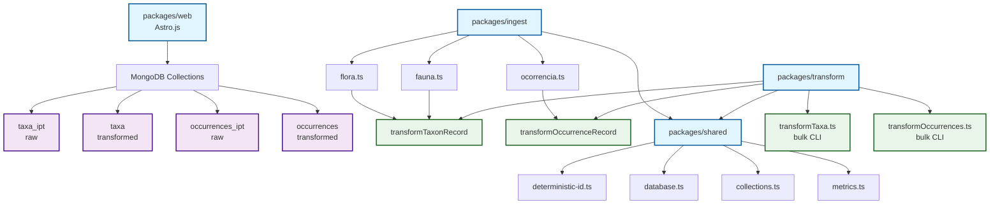
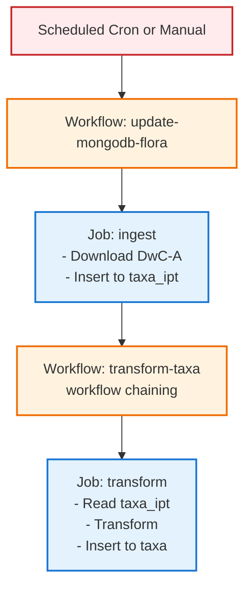
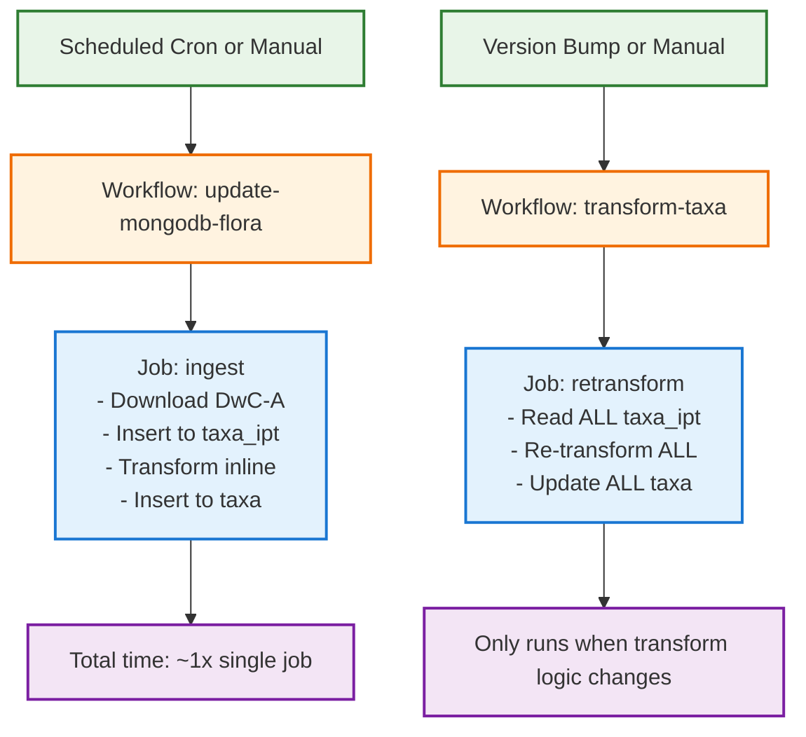
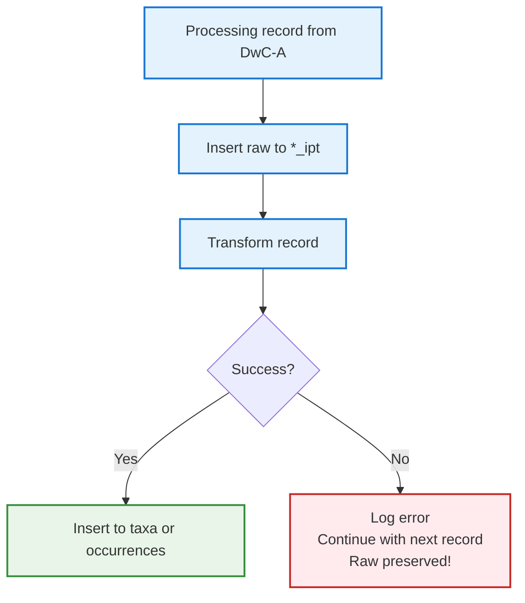

# Architecture Diagrams

## Package Dependency Graph



## Data Flow: Integrated Ingestion

```mermaid
flowchart TD
    A[1. Download DwC-A from IPT<br/>e.g., https://ipt.jbrj.gov.br/.../flora_brasil] --> B[2. Extract and parse DwC-A<br/>- Extract ZIP<br/>- Parse meta.xml<br/>- Parse taxon.txt/occurrence.txt]

    B --> C[3. For each record]

    C --> D[3a. Generate deterministic _id<br/>using shared/utils/deterministic-id.ts<br/>taxa: _id = taxonID<br/>occur: _id = occurrenceID::iptId]

    D --> E[3b. Upsert RAW document to MongoDB<br/>db.taxa_ipt.updateOne({_id}, {$set: rawDoc})<br/>OR<br/>db.occurrences_ipt.updateOne(...)]

    E --> F[3c. TRANSFORM inline, same process<br/>import transformTaxonRecord from '@darwincore/transform'<br/><br/>const transformed = await transformTaxonRecord(rawDoc, db)<br/><br/>Applies:<br/>- Normalization canonicalName, etc.<br/>- Enrichment ameaça, invasoras, UCs<br/>- Filters taxonRank, country, etc.]

    F --> G[3d. Upsert TRANSFORMED document to MongoDB<br/>SAME _id as raw<br/>db.taxa.updateOne({_id}, {$set: transformed})<br/>OR<br/>db.occurrences.updateOne(...)]

    G --> H[Both collections updated in sync<br/>taxa_ipt ✓<br/>taxa ✓]

    classDef step fill:#e3f2fd,stroke:#1976d2,stroke-width:2px
    classDef action fill:#f3e5f5,stroke:#7b1fa2,stroke-width:2px
    classDef result fill:#e8f5e8,stroke:#388e3c,stroke-width:2px

    class A,B,C step
    class D,E,F,G action
    class H result
```

## Data Flow: Bulk Re-transformation

```mermaid
flowchart TD
    A[Trigger:<br/>- Version bump in packages/transform/package.json<br/>- Changes to packages/transform/src/**<br/>- Manual workflow_dispatch] --> B[1. Acquire lock<br/>MongoDB transform_status collection<br/>Prevents concurrent runs]

    B --> C[2. Read ALL documents from raw collection batched<br/>db.taxa_ipt.find()<br/>OR<br/>db.occurrences_ipt.find()]

    C --> D[3. For each batch]

    D --> E[3a. Transform each record<br/>const transformed = await transformTaxonRecord(rawDoc, db)<br/><br/>Uses SAME transformation logic as ingest]

    E --> F[3b. Bulk upsert to transformed collection<br/>db.taxa.bulkWrite([<br/>{ updateOne: {<br/>filter: { _id: doc._id },<br/>update: { $set: transformed },<br/>upsert: true<br/>}} ])]

    F --> G[3c. Record metrics<br/>- Records processed<br/>- Duration<br/>- Error rate]

    G --> H[4. Release lock<br/>Update transform_status collection]

    H --> I[All transformed data refreshed from raw data]

    classDef trigger fill:#fff3e0,stroke:#ef6c00,stroke-width:2px
    classDef step fill:#e3f2fd,stroke:#1976d2,stroke-width:2px
    classDef action fill:#f3e5f5,stroke:#7b1fa2,stroke-width:2px
    classDef result fill:#e8f5e8,stroke:#388e3c,stroke-width:2px

    class A trigger
    class B,C,D step
    class E,F,G,H action
    class I result
```

## Workflow Execution Comparison

### OLD Architecture (v1)



### NEW Architecture (v2)



## Error Handling Flow


