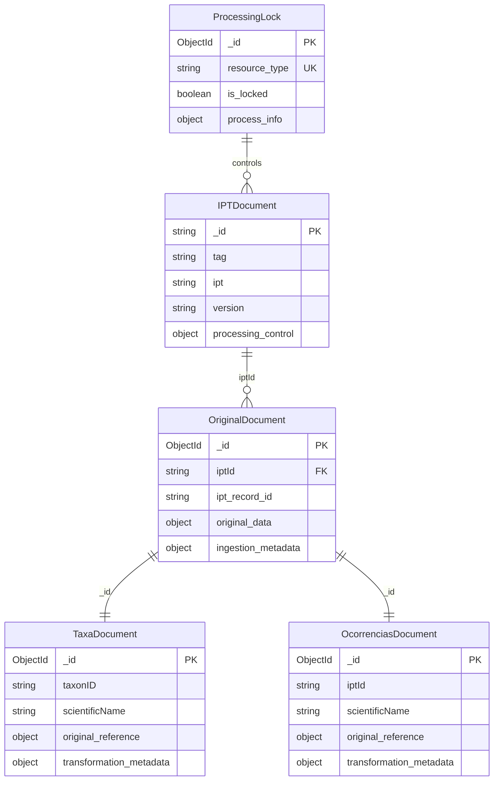

# Data Model: Manter Dados Originais

**Data**: 2025-09-29  
**Especificação**: [spec.md](./spec.md)  
**Pesquisa**: [research.md](./research.md)

# Data Model: Manter Dados Originais

**Data**: 2025-09-29  
**Especificação**: [spec.md](./spec.md)  
**Pesquisa**: [research.md](./research.md)

## Core Entities

### 1. OriginalDocument (taxaOriginal, ocorrenciasOriginal)

Armazena dados IPT sem nenhuma transformação, preservando estrutura exata da fonte.

```typescript
interface OriginalDocument {
  _id: ObjectId // ID único do documento
  iptId: string // Identificador do IPT (corresponde ao campo iptId atual)
  ipt: string // Tag do IPT (ex: "inpa", "jabot", "speciesLink")
  ipt_record_id: string // ID do registro no IPT original
  ipt_version: string // Hash/versão do IPT no momento da ingestão
  collection_type: 'fauna' | 'flora' | 'ocorrencias' // Tipo de dados

  // Dados originais exatos do DwC-A
  original_data: DwCRecord // Estrutura Darwin Core preservada

  // Metadados de ingestão
  ingestion_metadata: {
    timestamp: Date // Quando foi ingerido
    source_ipt_url: string // URL do IPT fonte
    processing_version: string // Versão do script de ingestão
    dwca_version: string // Versão do arquivo DwC-A
  }

  // Status de processamento
  processing_status: {
    is_processed: boolean // Se foi transformado
    last_transform_attempt: Date // Última tentativa de transformação
    transform_error?: string // Erro na transformação (se houver)
  }
}
```

**Validações**:

- `iptId` + `ipt_record_id` devem ser únicos por coleção
- `original_data` deve conter pelo menos os campos obrigatórios DwC
- `timestamp` não pode ser futuro
- `collection_type` deve corresponder à coleção física

**Índices**:

```javascript
// Consulta por IPT para remoção/atualização
{ iptId: 1, ipt_record_id: 1 }

// Consulta por versão para skip de reprocessamento
{ iptId: 1, ipt_version: 1 }

// Consulta por status de processamento
{ "processing_status.is_processed": 1 }

// Consulta temporal
{ "ingestion_metadata.timestamp": -1 }
```

### 2. TransformedDocument (taxa, ocorrencias)

Representa os documentos transformados nas coleções principais existentes.

```typescript
// Para a coleção 'taxa' (estrutura atual)
interface TaxaDocument {
  _id: ObjectId // MESMO ID do documento original
  taxonID: string
  parentNameUsageID?: string
  scientificName: string
  parentNameUsage?: string
  namePublishedIn?: string
  namePublishedInYear?: string
  higherClassification?: string
  kingdom: string
  phylum?: string
  class?: string
  order?: string
  family?: string
  genus?: string
  specificEpithet?: string
  taxonRank: string
  scientificNameAuthorship?: string
  taxonomicStatus?: string
  nomenclaturalStatus?: string
  modified: string
  bibliographicCitation?: string
  references?: string
  distribution?: any
  typesandspecimen?: any
  reference?: any
  speciesprofile?: any
  canonicalName: string
  flatScientificName: string

  // Novos campos para rastreabilidade
  original_reference?: {
    original_id: ObjectId // ID do documento original
    iptId: string // IPT de origem
    ipt_record_id: string // ID original no IPT
  }

  transformation_metadata?: {
    timestamp: Date // Quando foi transformado
    pipeline_version: string // Versão do pipeline usado
    transform_functions: string[] // Lista de funções aplicadas
    fallback_applied: boolean // Se usou fallback para dados originais
  }
}

// Para a coleção 'ocorrencias' (estrutura atual)
interface OcorrenciasDocument {
  _id: ObjectId // MESMO ID do documento original
  iptId: string // URL do IPT
  ipt: string // Tag do IPT
  canonicalName: string
  flatScientificName: string
  type?: string
  modified?: string
  language?: string
  rightsHolder?: string
  institutionID?: string
  institutionCode?: string
  collectionCode?: string
  datasetName?: string
  basisOfRecord?: string
  occurrenceID?: string
  catalogNumber?: string
  recordedBy?: string
  preparations?: string
  eventDate?: string
  higherGeography?: string
  continent?: string
  country?: string
  stateProvince?: string
  county?: string
  locality?: string
  scientificName: string
  kingdom?: string
  phylum?: string
  class?: string
  order?: string
  family?: string
  genus?: string
  specificEpithet?: string
  day?: number
  month?: number
  year?: number

  // Novos campos para rastreabilidade
  original_reference?: {
    original_id: ObjectId // ID do documento original
    iptId: string // IPT de origem (mesmo que iptId acima)
    ipt_record_id: string // ID original no IPT
  }

  transformation_metadata?: {
    timestamp: Date // Quando foi transformado
    pipeline_version: string // Versão do pipeline usado
    transform_functions: string[] // Lista de funções aplicadas
    fallback_applied: boolean // Se usou fallback para dados originais
  }
}
```

**Validações**:

- `_id` deve existir em coleção original correspondente
- `transformation_metadata.timestamp` >= `original.ingestion_metadata.timestamp`
- `original_reference.original_id` deve referenciar documento válido

**Índices**:

```javascript
// Referência ao original
{ "original_reference.original_id": 1 }

// Consulta por IPT (mantém compatibilidade)
{ iptId: 1 }

// Consulta temporal
{ "transformation_metadata.timestamp": -1 }
```

### 3. IPTMetadata

Baseado na estrutura atual da coleção `ipts` com extensões para controle de versão.

```typescript
// Coleção 'ipts' existente com extensões
interface IPTDocument {
  _id: string // URL do IPT (mantém estrutura atual)
  abstract?: any
  alternateIdentifier?: string[]
  associatedParty?: any
  contact?: any
  coverage?: any
  creator?: any
  distribution?: any
  intellectualRights?: any
  ipt: string // Tag do IPT (ex: "inpa", "jabot")
  keywordSet?: any[]
  kingdom?: string
  language?: string
  licensed?: any
  maintenance?: any
  metadataProvider?: any
  pubDate?: string
  tag: string // Tag do IPT
  title?: any
  version: string // Versão atual do IPT

  // Novos campos para controle de processamento
  processing_control?: {
    last_ingestion_check: Date // Última verificação
    last_ingestion_fauna?: Date // Última ingestão fauna
    last_ingestion_flora?: Date // Última ingestão flora
    last_ingestion_ocorrencias?: Date // Última ingestão ocorrências
    version_hash?: string // Hash para detectar mudanças
    is_processing?: boolean // Se está sendo processado
    next_scheduled?: Date // Próxima execução agendada
  }

  // Estatísticas por tipo
  statistics?: {
    fauna?: {
      total_documents: number
      processed_documents: number
      failed_documents: number
    }
    flora?: {
      total_documents: number
      processed_documents: number
      failed_documents: number
    }
    ocorrencias?: {
      total_documents: number
      processed_documents: number
      failed_documents: number
    }
  }
}
```

**Validações**:

- `_id` deve ser URL válida e acessível
- `tag` deve ser único
- `version` deve seguir padrão semântico

**Índices**:

```javascript
// Consulta por tag
{ tag: 1 }

// Consulta por tipo de kingdom
{ kingdom: 1 }

// Controle de processamento
{ "processing_control.is_processing": 1 }

// Agendamento
{ "processing_control.next_scheduled": 1 }
```

### 4. ProcessingLock

Nova coleção para controlar concorrência de processamento.

```typescript
interface ProcessingLock {
  _id: ObjectId
  resource_type:
    | 'fauna_ingestion'
    | 'flora_ingestion'
    | 'ocorrencias_ingestion'
    | 'fauna_transformation'
    | 'flora_transformation'
    | 'ocorrencias_transformation'

  // Estado do lock
  is_locked: boolean
  locked_at: Date
  locked_by: string // Identificador do processo/workflow
  lock_expires_at: Date // Expiração automática do lock

  // Metadados do processo
  process_info: {
    workflow_run_id?: string // ID do GitHub Actions run
    iptId?: string // IPT sendo processado (se aplicável)
    estimated_duration: number // Duração estimada (ms)
    progress_info?: string // Informações de progresso
  }
}
```

**Validações**:

- `resource_type` deve ser único quando `is_locked = true`
- `lock_expires_at` > `locked_at`
- `locked_by` obrigatório quando `is_locked = true`

**Índices**:

```javascript
// Controle de locks
{ resource_type: 1, is_locked: 1 }

// Limpeza de locks expirados
{ lock_expires_at: 1 }
```

## Relacionamentos



## Estados e Transições

### Estado do Documento Original

1. **Novo** → Ingerido mas não transformado
2. **Processado** → Transformação bem-sucedida
3. **Falha** → Transformação falhou, usando fallback
4. **Obsoleto** → Removido do IPT fonte

### Estado do IPT

1. **Descoberto** → IPT identificado mas não processado
2. **Processando** → Ingestão em andamento
3. **Atualizado** → Ingestão completa e atual
4. **Erro** → Falha na ingestão
5. **Obsoleto** → IPT não disponível

### Estado do Lock

1. **Livre** → Recurso disponível para processamento
2. **Bloqueado** → Processamento em andamento
3. **Expirado** → Lock expirou, requer limpeza

## Migração e Compatibilidade

### Estratégia de Migração das Coleções Existentes

```typescript
// Adicionar campos de rastreabilidade às coleções existentes
interface MigrationPlan {
  // Fase 1: Adicionar campos opcionais
  addOptionalFields: {
    taxa: ['original_reference?', 'transformation_metadata?']
    ocorrencias: ['original_reference?', 'transformation_metadata?']
    ipts: ['processing_control?', 'statistics?']
  }

  // Fase 2: Popular campos para documentos existentes
  populateExistingDocuments: {
    // Documentos atuais são considerados "transformados" sem original
    // original_reference fica null para dados legacy
    markAsLegacyTransformed: true
  }

  // Fase 3: Criar coleções originais
  createOriginalCollections: ['taxaOriginal', 'ocorrenciasOriginal']

  // Fase 4: Criar índices
  createIndexes: true
}
```

### Backward Compatibility

- Documentos existentes continuam funcionando normalmente
- Campos novos são opcionais inicialmente
- Queries existentes não são afetadas
- Interface web mantém compatibilidade
- Versionamento de pipelines para reproduzibilidade

## Performance Considerations

### Coleções Separadas vs Subdocumentos

**Decisão**: Coleções separadas para originais e transformados

- **Vantagem**: Queries independentes, índices otimizados por uso, compatibilidade com estrutura atual
- **Desvantagem**: Joins manuais necessários
- **Justificativa**: Padrões de acesso muito diferentes entre originais (auditoria) e transformados (aplicação)

### Estratégia de Sharding

```javascript
// Sharding por collection_type + iptId
sh.shardCollection('dwc2json.taxaOriginal', {
  collection_type: 1,
  iptId: 1
})

sh.shardCollection('dwc2json.ocorrenciasOriginal', {
  collection_type: 1,
  iptId: 1
})
```

### Cache Strategy

- Metadados de IPT em cache para verificações frequentes
- Índices otimizados para queries de performance crítica
- Invalidação automática de cache em atualizações

## Integração com Estrutura Atual

### Compatibilidade com DbIpt

```typescript
// Manter compatibilidade com tipo existente
export type DbIpt = {
  _id: string // URL do IPT
  tag: string // Tag identificadora
  collection: string // Tipo de coleção (será depreciado)
  version: string // Versão do IPT
  // ... demais campos da estrutura atual

  // Extensões para novo sistema
  processing_control?: ProcessingControl
  statistics?: CollectionStatistics
}

// Mapeamento para novo sistema
const mapToNewStructure = (dbIpt: DbIpt): IPTDocument => ({
  _id: dbIpt._id,
  tag: dbIpt.tag,
  version: dbIpt.version,
  // ... mapear demais campos
  processing_control: dbIpt.processing_control,
  statistics: dbIpt.statistics
})
```
