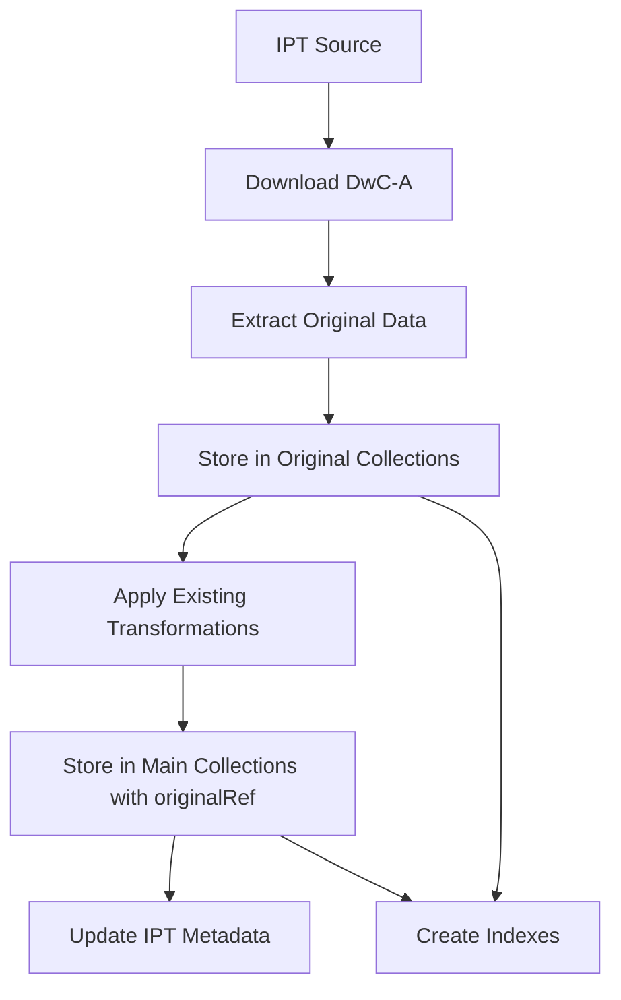

# Especificação: Preservação de Dados Originais IPT

## Visão Geral

Esta especificação define a implementação da funcionalidade "manter dados originais" no sistema ChatBB, preservando os dados brutos dos IPTs (Integrated Publishing Toolkit) em coleções MongoDB separadas, enquanto mantém o pipeline de transformação para as coleções principais existentes.

## Objetivo

Refatorar os workflows de ingestão existentes para implementar um sistema dual de armazenamento que:

1. Preserva dados originais em coleções `taxaOriginal` e `ocorrenciasOriginal`
2. Mantém o pipeline de transformação existente para as coleções principais (`taxa` e `ocorrencias`)
3. Fornece rastreabilidade completa dos dados através dos metadados IPT
4. Garante compatibilidade com os workflows GitHub Actions atuais

## Escopo

### Incluído no Escopo

- Refatoração dos scripts de ingestão existentes (`fauna.ts`, `flora.ts`, `ocorrencia.ts`)
- Criação de coleções MongoDB para dados originais (`taxaOriginal`, `ocorrenciasOriginal`)
- Implementação de rastreabilidade de transformações
- Manutenção dos workflows GitHub Actions existentes (sem modificação de estrutura)
- Preservação dos metadados IPT originais com integração ao tipo `DbIpt`

### Fora do Escopo

- Modificação da interface web existente
- Criação de APIs REST adicionais
- Alteração da estrutura das coleções principais existentes
- Interface de usuário para visualização dos dados originais
- Modificação dos cronogramas dos workflows (cron schedules)

## Contexto dos Workflows Existentes

### Estrutura Atual dos Workflows

#### Workflow Fauna (update-mongodb-fauna.yml)

- **Cron**: `30 2 * * 0` (Domingos às 02:30)
- **Script**: `bun run --filter @darwincore/ingest fauna`
- **Fonte**: DWCA_URL do JBRJ (Jardim Botânico do Rio de Janeiro)
- **Coleção**: `taxa` (kingdom: 'Animalia')

#### Workflow Flora (update-mongodb-flora.yml)

- **Cron**: `0 2 * * 0` (Domingos às 02:00)
- **Script**: `bun run --filter @darwincore/ingest flora`
- **Fonte**: DWCA_URL do JBRJ
- **Coleção**: `taxa` (kingdom: 'Plantae', 'Fungi')

#### Workflow Ocorrências (update-mongodb-occurrences.yml)

- **Cron**: `0 3 * * 0` (Domingos às 03:00)
- **Script**: `bun run --filter @darwincore/ingest occurrences`
- **Fonte**: Múltiplos IPTs via `referencias/occurrences.csv`
- **Coleção**: `ocorrencias`
- **Pós-processamento**: Cache clearing (`cache-dashboard`)

### Scripts de Ingestão Atuais

#### fauna.ts

- Processa dados DwC-A de fauna (kingdom: 'Animalia')
- Aplica transformações específicas (distribution, resourcerelationship, etc.)
- Insere em `taxa` com limpeza por kingdom
- Gerencia versioning via coleção `ipts`

#### flora.ts

- Processa dados DwC-A de flora/fungi (kingdom: 'Plantae', 'Fungi')
- Aplica transformações similares à fauna com diferenças específicas
- Insere em `taxa` com limpeza por kingdom
- Gerencia versioning via coleção `ipts`

#### ocorrencia.ts

- Processa múltiplos IPTs via CSV de configuração
- Aplica transformações complexas (geospatial, normalization, etc.)
- Insere em `ocorrencias` com verificação de versão individual por IPT
- Gerencia concorrência e timeouts para múltiplos servidores IPT

## Requisitos Técnicos

### Requisitos Funcionais

#### RF001 - Preservação de Dados Originais

**Descrição**: O sistema deve preservar os dados originais de IPTs em coleções separadas antes da transformação
**Critérios de Aceitação**:

- Dados originais devem ser armazenados nas coleções `taxaOriginal` e `ocorrenciasOriginal`
- Estrutura original dos documentos deve ser mantida sem transformações
- Metadados IPT devem ser preservados junto com cada documento

#### RF002 - Rastreabilidade de Transformações

**Descrição**: O sistema deve manter rastreabilidade entre dados originais e transformados
**Critérios de Aceitação**:

- Cada documento transformado deve referenciar o documento original correspondente
- Metadados de transformação devem incluir timestamp e versão do script
- Pipeline de transformação deve ser documentado no nível do documento

#### RF003 - Compatibilidade com Workflows Existentes

**Descrição**: O sistema deve manter total compatibilidade com os workflows GitHub Actions existentes
**Critérios de Aceitação**:

- Scripts existentes devem ser modificados internamente sem alterar interface
- Workflows GitHub Actions devem continuar funcionando sem modificações
- Cronogramas e configurações de workflows devem permanecer inalterados
- Performance da ingestão não deve ser significativamente impactada

#### RF004 - Integração com Sistema de Versioning

**Descrição**: O sistema deve integrar com o sistema de versioning IPT existente
**Critérios de Aceitação**:

- Versioning baseado na coleção `ipts` deve ser mantido
- Dados originais devem ser versionados junto com dados transformados
- Limpeza de versões antigas deve incluir dados originais

### Requisitos Não-Funcionais

#### RNF001 - Performance

- Tempo de ingestão não deve aumentar mais que 25%
- Índices apropriados devem ser criados para consultas eficientes
- Processamento de dados originais deve ser otimizado

#### RNF002 - Armazenamento

- Duplicação de dados deve ser gerenciada eficientemente
- Compressão MongoDB deve ser utilizada quando apropriada
- Índices devem ser otimizados para minimizar overhead

#### RNF003 - Integridade

- Dados originais devem ser imutáveis após inserção
- Referências entre coleções devem ser consistentes
- Falhas na preservação original não devem impedir transformação

## Arquitetura de Refatoração

### Estrutura de Coleções

#### Nova Coleção `taxaOriginal`

```typescript
interface TaxaOriginalDocument {
  _id: string // ID gerado pelo MongoDB
  iptId: string // ID do IPT fonte (referência para DbIpt)
  originalId: string // ID original do documento no DwC-A
  originalData: any // Dados originais sem transformação
  metadata: {
    ingestedAt: Date // Timestamp de ingestão
    iptVersion: string // Versão do IPT (compatível com DbIpt.version)
    scriptVersion: string // Versão do script de transformação
    kingdom: string // Reino (Animalia/Plantae/Fungi)
    sourceUrl: string // URL fonte do DwC-A
  }
}
```

#### Nova Coleção `ocorrenciasOriginal`

```typescript
interface OcorrenciasOriginalDocument {
  _id: string // ID gerado pelo MongoDB
  iptId: string // ID do IPT fonte (referência para DbIpt)
  originalId: string // ID original do documento no DwC-A
  originalData: any // Dados originais sem transformação
  metadata: {
    ingestedAt: Date // Timestamp de ingestão
    iptVersion: string // Versão do IPT (compatível com DbIpt.version)
    scriptVersion: string // Versão do script de transformação
    kingdom: string[] // Reinos associados ao IPT
    sourceUrl: string // URL fonte do DwC-A
    tag: string // Tag do IPT fonte
    repositorio: string // Nome do repositório
  }
}
```

#### Modificações nas Coleções Principais

As coleções `taxa` e `ocorrencias` receberão novos campos opcionais para rastreabilidade:

```typescript
interface TransformedDocument {
  // ... campos existentes ...
  originalRef?: {
    collectionName: string // "taxaOriginal" ou "ocorrenciasOriginal"
    documentId: string // _id do documento original
    transformedAt: Date // Timestamp da transformação
    scriptVersion: string // Versão do script de transformação
  }
}
```

### Fluxo de Dados Refatorado



## Implementação

### Abordagem de Refatoração

#### Estratégia de Modificação

1. **Preservar interfaces existentes**: Scripts mantêm mesma assinatura e comportamento externo
2. **Adicionar camadas de preservação**: Inserir lógica de armazenamento original antes da transformação
3. **Manter compatibilidade**: Garantir que falhas na preservação não quebrem o fluxo principal
4. **Otimizar performance**: Implementar armazenamento original de forma eficiente

#### Padrão de Implementação

```typescript
// Padrão geral para todos os scripts
async function storeOriginalData(data: any[], ipt: Ipt, metadata: any) {
  // Lógica para armazenar dados originais
}

async function main() {
  // 1. Download e extração (existente)
  const { json, ipt } = await processaZip(url);

  // 2. NOVO: Armazenar dados originais
  await storeOriginalData(Object.entries(json), ipt, {...});

  // 3. Transformação (existente)
  const transformedData = processaData(json);

  // 4. Armazenamento transformado (modificado para incluir originalRef)
  await storeTransformedData(transformedData, ipt);
}
```

### Fase 1: Refatoração do Script fauna.ts

#### 1.1 Funções Adicionais

```typescript
interface OriginalTaxaStorage {
  storeOriginalTaxa(
    entries: [string, any][],
    ipt: Ipt,
    kingdom: string
  ): Promise<Map<string, string>>
  cleanOriginalTaxa(iptId: string): Promise<void>
}
```

#### 1.2 Modificações na Função Principal

- Adicionar armazenamento original antes da transformação
- Modificar inserção em `taxa` para incluir `originalRef`
- Manter lógica de versioning existente

### Fase 2: Refatoração do Script flora.ts

#### 2.1 Implementação Similar

- Aplicar mesmo padrão do fauna.ts
- Considerar diferenças específicas (Plantae + Fungi)
- Manter compatibilidade com transformações existentes

### Fase 3: Refatoração do Script ocorrencia.ts

#### 3.1 Desafios Específicos

- Múltiplos IPTs processados em batch
- Concorrência e timeouts
- Diferentes configurações por IPT via CSV

#### 3.2 Estratégia de Implementação

- Armazenar originais por IPT individual
- Manter verificação de versão individual
- Implementar limpeza granular por IPT

### Fase 4: Criação de Índices e Otimizações

#### 4.1 Índices para Coleções Originais

```javascript
// taxaOriginal
db.taxaOriginal.createIndex({ iptId: 1, originalId: 1 }, { unique: true })
db.taxaOriginal.createIndex({ 'metadata.kingdom': 1 })
db.taxaOriginal.createIndex({ 'metadata.ingestedAt': 1 })
db.taxaOriginal.createIndex({ 'metadata.iptVersion': 1 })

// ocorrenciasOriginal
db.ocorrenciasOriginal.createIndex(
  { iptId: 1, originalId: 1 },
  { unique: true }
)
db.ocorrenciasOriginal.createIndex({ 'metadata.kingdom': 1 })
db.ocorrenciasOriginal.createIndex({ 'metadata.ingestedAt': 1 })
db.ocorrenciasOriginal.createIndex({ 'metadata.tag': 1 })
db.ocorrenciasOriginal.createIndex({ 'metadata.repositorio': 1 })
```

#### 4.2 Índices para Rastreabilidade

```javascript
// taxa
db.taxa.createIndex({ 'originalRef.documentId': 1 }, { sparse: true })

// ocorrencias
db.ocorrencias.createIndex({ 'originalRef.documentId': 1 }, { sparse: true })
```

## Validação e Testes

### Cenários de Teste

#### CT001 - Refatoração fauna.ts

1. Executar script fauna.ts com URL existente
2. Verificar armazenamento em `taxaOriginal`
3. Verificar transformação mantida em `taxa`
4. Validar rastreabilidade através de `originalRef`
5. Confirmar que workflow GitHub Actions continua funcionando

#### CT002 - Refatoração flora.ts

1. Executar script flora.ts
2. Verificar armazenamento em `taxaOriginal` para Plantae/Fungi
3. Verificar compatibilidade com transformações específicas de flora
4. Validar integração com workflow existente

#### CT003 - Refatoração ocorrencia.ts

1. Executar script ocorrencia.ts com CSV existente
2. Verificar armazenamento em `ocorrenciasOriginal` para múltiplos IPTs
3. Verificar manutenção de concorrência e timeouts
4. Validar processamento individual por IPT

#### CT004 - Compatibilidade de Workflows

1. Executar workflows GitHub Actions sem modificações
2. Verificar cronogramas mantidos
3. Confirmar que cache clearing continua funcionando
4. Validar self-hosted runners continuam operacionais

### Critérios de Aceitação

#### CA001 - Integridade dos Dados Originais

- Todos os dados originais devem ser preservados sem modificação
- Número de documentos em coleções originais deve corresponder aos transformados
- Rastreabilidade deve ser consistente onde implementada

#### CA002 - Compatibilidade Total

- Workflows GitHub Actions devem funcionar sem modificações
- Scripts devem manter mesma interface externa
- Cronogramas e configurações devem permanecer inalterados

#### CA003 - Performance Aceitável

- Tempo de ingestão não deve exceder 125% do tempo original
- Uso de memória deve permanecer dentro de limites aceitáveis
- Falhas na preservação original não devem quebrar fluxo principal

## Cronograma

### Sprint 1 (Semana 1-2)

- [ ] Análise detalhada dos scripts existentes
- [ ] Design da arquitetura de preservação original
- [ ] Implementação da refatoração do fauna.ts
- [ ] Testes iniciais de compatibilidade

### Sprint 2 (Semana 3-4)

- [ ] Refatoração do flora.ts
- [ ] Refatoração do ocorrencia.ts
- [ ] Implementação de índices otimizados
- [ ] Testes de integração com workflows

### Sprint 3 (Semana 5-6)

- [ ] Testes de performance e otimização
- [ ] Validação de compatibilidade total
- [ ] Documentação técnica
- [ ] Preparação para deploy

## Riscos e Mitigações

### R001 - Quebra de Compatibilidade

**Risco**: Modificações internas quebram workflows existentes
**Mitigação**: Manter interfaces externas inalteradas e testes extensivos

### R002 - Impact na Performance

**Risco**: Duplicação causa degradação significativa
**Mitigação**: Otimização de índices e implementação assíncrona quando possível

### R003 - Falhas na Preservação Original

**Risco**: Erros na preservação quebram fluxo principal
**Mitigação**: Implementar preservação como best-effort, sem bloquear transformação

### R004 - Aumento Excessivo de Armazenamento

**Risco**: Duplicação dobra uso de storage
**Mitigação**: Monitoramento de uso e implementação de compressão

## Conclusão

Esta especificação define uma abordagem de refatoração conservadora que preserva a funcionalidade existente enquanto adiciona capacidades de preservação de dados originais. A estratégia prioriza compatibilidade total com workflows existentes e minimiza riscos operacionais através de modificações internas controladas.

## Execution Flow (main)

```
1. Parse user description from Input
   → Feature clearly defined: preserve original data during IPT ingestion
2. Extract key concepts from description
   → Actors: data ingestion system, transformation workflows
   → Actions: ingest raw data, transform data, maintain parallel collections
   → Data: IPT data (fauna, flora, ocorrencias), original and transformed collections
   → Constraints: same ID requirement, clear separation of transformation pipeline
3. For each unclear aspect:
   → All key aspects are well-defined in the description
4. Fill User Scenarios & Testing section
   → Data administrator ingests IPT data and verifies original preservation
5. Generate Functional Requirements
   → Each requirement is testable and specific
6. Identify Key Entities
   → Collections, documents, transformation workflows
7. Run Review Checklist
   → No implementation details, focused on business needs
8. Return: SUCCESS (spec ready for planning)
```

---

## ⚡ Quick Guidelines

- ✅ Focus on WHAT users need and WHY
- ❌ Avoid HOW to implement (no tech stack, APIs, code structure)
- 👥 Written for business stakeholders, not developers

---

## Clarifications

### Session 2025-09-29

- Q: Que informações específicas devem ser rastreadas entre documentos originais e transformados? → A: Apenas referência bidirecional por ID
- Q: Como o sistema deve tratar tentativas simultâneas de transformação dos mesmos dados originais? → A: Cancelar atual; enfileirar próximo
- Q: O que o sistema deve fazer quando encontra um documento original com ID duplicado durante nova ingestão? → A: Sobrescrever dados originais existentes
- Q: Como o sistema deve proceder quando o pipeline de transformação falha parcialmente (alguns documentos processados, outros não)? → A: Ignorar falhas ao transformar -> fallback para o valor original na base transformada
- Q: Qual deve ser o nível de granularidade para tornar o pipeline de transformação "bem destacado e evidente"? → A: cada transformação deve ser definida como uma função de entrada e saída. O pipeline de transformação deve executrar todas em série, para cada documento

---

## User Scenarios & Testing _(mandatory)_

### Primary User Story

Como administrador de dados de biodiversidade, eu preciso que todos os dados originais dos IPTs sejam preservados integralmente durante o processo de ingestão, para que eu possa rastrear transformações, auditar mudanças, e garantir a integridade científica dos dados mesmo após processamento.

### Acceptance Scenarios

1. **Given** que novos dados de fauna são recebidos de um IPT, **When** o sistema executa a ingestão, **Then** os dados originais devem ser armazenados na coleção `taxaOriginal` sem nenhuma transformação
2. **Given** que dados originais foram armazenados, **When** o pipeline de transformação é executado, **Then** os dados transformados devem ser armazenados na coleção principal `taxa` mantendo exatamente o mesmo ID do documento original
3. **Given** que dados de ocorrências são ingeridos, **When** o processo é completado, **Then** cada documento original em `occurrenciasOriginal` deve ter um documento correspondente em `ocorrencias` com ID idêntico
4. **Given** que um workflow de transformação falha, **When** o administrador reinicia o processo, **Then** o sistema deve poder reprocessar os dados originais sem precisar fazer nova ingestão do IPT

### Edge Cases

- **Documentos duplicados**: Quando um documento original já existe com o mesmo ID durante uma nova ingestão, o sistema deve sobrescrever os dados originais existentes
- **Falhas na transformação**: Quando o pipeline de transformação falha para um documento específico, o sistema deve usar fallback copiando o valor original para a base transformada
- O que acontece se um documento original for corrompido mas o transformado ainda existir?

## Requirements _(mandatory)_

### Functional Requirements

- **FR-001**: Sistema DEVE preservar todos os dados originais dos IPTs em coleções separadas (`taxaOriginal`, `occurrenciasOriginal`) sem nenhuma modificação
- **FR-002**: Sistema DEVE aplicar transformações apenas nos dados que vão para as coleções principais (`taxa`, `ocorrencias`)
- **FR-003**: Sistema DEVE garantir que cada documento original tenha exatamente o mesmo ID do documento transformado correspondente
- **FR-004**: Sistema DEVE manter pipeline de transformação onde cada transformação é definida como função de entrada e saída, executadas em série para cada documento
- **FR-005**: Sistema DEVE permitir workflows independentes de transformação para cada tipo de dados (fauna, flora, ocorrencias) com controle de concorrência por enfileiramento sequencial
- **FR-006**: Sistema DEVE permitir reprocessamento de transformações a partir dos dados originais sem necessidade de nova ingestão
- **FR-007**: Sistema DEVE manter referência bidirecional por ID entre documentos originais e transformados
- **FR-008**: Sistema DEVE preservar metadados de origem e timestamp de ingestão tanto nos dados originais quanto transformados

### Key Entities _(include if feature involves data)_

- **Coleção Original**: Armazena dados IPT sem transformação, mantém estrutura exata da fonte
- **Coleção Principal**: Armazena dados transformados para uso da aplicação, com estrutura padronizada
- **Pipeline de Transformação**: Processo composto por funções sequenciais de entrada e saída que convertem dados originais em formato padronizado
- **Documento Original**: Registro individual preservado exatamente como recebido do IPT
- **Documento Transformado**: Registro processado e padronizado, vinculado ao original pelo ID
- **Workflow de Tipo**: Processo específico de transformação para cada categoria (fauna, flora, ocorrencias)

---

## Review & Acceptance Checklist

_GATE: Automated checks run during main() execution_

### Content Quality

- [x] No implementation details (languages, frameworks, APIs)
- [x] Focused on user value and business needs
- [x] Written for non-technical stakeholders
- [x] All mandatory sections completed

### Requirement Completeness

- [x] No [NEEDS CLARIFICATION] markers remain
- [x] Requirements are testable and unambiguous
- [x] Success criteria are measurable
- [x] Scope is clearly bounded
- [x] Dependencies and assumptions identified

---

## Execution Status

_Updated by main() during processing_

- [x] User description parsed
- [x] Key concepts extracted
- [x] Ambiguities marked
- [x] User scenarios defined
- [x] Requirements generated
- [x] Entities identified
- [x] Review checklist passed

---
